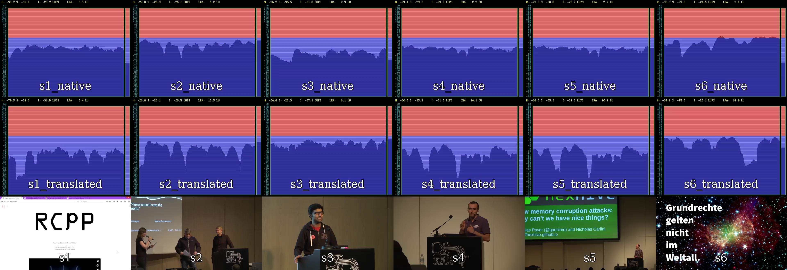

# MultiView Monitor
This tool uses the ffmpeg `ebur128` Filter to produce realtime loudness charts for multiple streams, which are then mixed into a larger video-stream within gstreamer.
The resulting multiview of the loudness charts can now be streamed back to the streaming-server, which makes it easily available for people to check.

